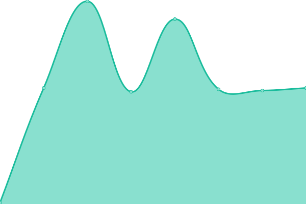

# [📈 Live Status](https://status.phyrone.de): <!--live status--> **🟧 Partial outage**

This repository contains the open-source uptime monitor and status page for [Upptime](https://upptime.js.org), powered by [Upptime](https://github.com/upptime/upptime).

With [Upptime](https://upptime.js.org), you can get your own unlimited and free uptime monitor and status page, powered entirely by a GitHub repository. We use [Issues](https://github.com/upptime/upptime/issues) as incident reports, [Actions](https://github.com/Phyrone/status.phyrone.de/actions) as uptime monitors, and [Pages](https://demo.upptime.js.org) for the status page.

<!--start: status pages-->
<!-- This summary is generated by Upptime (https://github.com/upptime/upptime) -->
<!-- Do not edit this manually, your changes will be overwritten -->
<!-- prettier-ignore -->
| URL | Status | History | Response Time | Uptime |
| --- | ------ | ------- | ------------- | ------ |
|  [Homepage](https://www.phyrone.de/) | 🟩 Up | [homepage.yml](https://github.com/Phyrone/status.phyrone.de/commits/HEAD/history/homepage.yml) | 

 223ms
     
 | 

<a href="https://status.phyrone.de/history/homepage">100.00%</a>
    

|  [Nextcloud](https://cloud.phyrone.de/) | 🟥 Down | [nextcloud.yml](https://github.com/Phyrone/status.phyrone.de/commits/HEAD/history/nextcloud.yml) | 

 950ms
     
 | 

<a href="https://status.phyrone.de/history/nextcloud">0.00%</a>
    

|  [Gitea](https://git.phyrone.de/) | 🟩 Up | [gitea.yml](https://github.com/Phyrone/status.phyrone.de/commits/HEAD/history/gitea.yml) | 

 668ms
     
 | 

<a href="https://status.phyrone.de/history/gitea">100.00%</a>
    

|  [Snapdrop](https://drop.phyrone.de/) | 🟩 Up | [snapdrop.yml](https://github.com/Phyrone/status.phyrone.de/commits/HEAD/history/snapdrop.yml) | 

 676ms
     
 | 

<a href="https://status.phyrone.de/history/snapdrop">100.00%</a>
    

|  [N8N](https://n8n.phyrone.de/) | 🟥 Down | [n8-n.yml](https://github.com/Phyrone/status.phyrone.de/commits/HEAD/history/n8-n.yml) | 

 951ms
     
 | 

<a href="https://status.phyrone.de/history/n8-n">0.00%</a>
    

|  [SMTP](mx.phyrone.email) | 🟩 Up | [smtp.yml](https://github.com/Phyrone/status.phyrone.de/commits/HEAD/history/smtp.yml) | 

 118ms
     
 | 

<a href="https://status.phyrone.de/history/smtp">100.00%</a>
    

|  [SMTPS](mx.phyrone.email) | 🟩 Up | [smtps.yml](https://github.com/Phyrone/status.phyrone.de/commits/HEAD/history/smtps.yml) | 

 118ms
     
 | 

<a href="https://status.phyrone.de/history/smtps">100.00%</a>
    

|  [Mail (Web) Server](https://mail.phyrone.de/) | 🟩 Up | [mail-web-server.yml](https://github.com/Phyrone/status.phyrone.de/commits/HEAD/history/mail-web-server.yml) | 

 706ms
     
 | 

<a href="https://status.phyrone.de/history/mail-web-server">100.00%</a>
    

<!--end: status pages-->

[**Visit our status website →**](https://status.phyrone.de)

## 📄 License

- Powered by: [Upptime](https://github.com/upptime/upptime)
- Code: [MIT](./LICENSE) © [Upptime](https://upptime.js.org)
- Data in the `./history` directory: [Open Database License](https://opendatacommons.org/licenses/odbl/1-0/)
